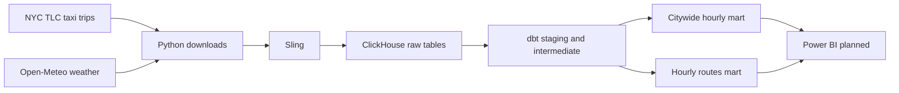

# NYC Taxi & Weather Data Pipeline

## Project overview

An end-to-end data pipeline combining NYC Yellow Taxi trips with hourly weather data. Python downloads the source files, Sling loads them into ClickHouse, and dbt prepares hourly datasets for analysis.

The project covers January 2025 through May 2026. Taxi trips come from the NYC Taxi and Limousine Commission (TLC); weather comes from the Open-Meteo historical weather API.

The planned Power BI dashboard will show citywide taxi activity and trip validity, then allow users to select an hour and pickup zone to explore the most common destinations on a map and in a table. Weather is represented by one hourly series for New York City and does not change when a taxi zone is selected.

## Architecture



Docker Compose runs ClickHouse with persistent storage. `uv` manages the Python environment. Staging and intermediate dbt models are views; both analytical marts are ClickHouse `MergeTree` tables.

The taxi zone lookup is loaded as a dbt seed. The routes mart joins it twice: once for the pickup zone and once for the dropoff zone.

## Data layers

| Relation | Grain | Purpose |
|---|---|---|
| `raw_taxi_trips` | One source taxi record | Taxi Parquet records loaded by Sling, including ingestion metadata. |
| `raw_weather` | One monthly JSON payload | Open-Meteo hourly arrays loaded by Sling. |
| `taxi_zone_lookup` | One taxi zone ID | dbt seed with zone, borough, and service zone names. |
| `stg_taxi_trips` | One source taxi record | Standardizes taxi column names. |
| `stg_weather_hourly` | One weather hour | Expands the weather arrays into hourly records. |
| `int_taxi_trips_clean` | One retained taxi record | Keeps pickups in `[2025-01-01, 2026-06-01)` and adds the pickup hour and trip quality flags. |
| `int_taxi_hourly` | One pickup hour | Aggregates citywide trip counts and metrics. |
| `mart_taxi_weather_hourly` | One weather hour | Combines the citywide hourly taxi metrics with the weather timeline. |
| `mart_taxi_routes_hourly` | One pickup hour, pickup zone ID, dropoff zone ID, and validity flag | Counts trips by route and adds pickup and dropoff zone names. |

The routes mart keeps valid and invalid trips in separate rows. To calculate the number of trips for a selection, sum `trip_count`; counting rows in the mart would give a different result.

Weather is one representative hourly series for New York City, not an average of observations from every taxi zone. The citywide weather mart and the routes mart remain separate so weather measurements are not multiplied by the number of routes.

Weather timestamps preserve Open-Meteo local clock values in a UTC-typed column without converting the clock time. This allows them to match the timezone-naive taxi pickup hours; `America/New_York` remains timezone metadata.

## Data quality

Suspicious taxi records remain available for analysis. A valid trip has dropoff after pickup, duration of at most 240 minutes, distance greater than zero and at most 100 miles, and non-negative fare and total amount. Missing passenger count is informational.

dbt checks cover required fields, accepted flag values, unique weather hours, hourly metric consistency, and the unique combination of pickup hour, pickup zone ID, dropoff zone ID, and validity in the routes mart.

The routes mart was checked against `int_taxi_trips_clean`: summing its `trip_count` gives the same **67,721,846** retained trips. A separate SQL test found no duplicate route keys. The column tests for the routes mart also passed.

## Verified results

| Metric | Result |
|---|---:|
| Raw taxi records | 67,721,884 |
| Retained taxi records | 67,721,846 |
| Valid trips | 62,242,363 |
| Invalid trips | 5,479,483 |
| Citywide weather mart rows | 12,384 |
| Routes mart rows | 29,451,015 |
| Trips summed from routes mart | 67,721,846 |
| Taxi zones in lookup seed | 265 |
| Taxi zone boundaries available for the map | 263 |

The retained taxi model restricts pickup time to January 2025 through May 2026. The citywide weather timeline includes hours without taxi records; their trip counts are zero.

The routes mart is sorted by pickup hour, pickup location ID, dropoff location ID, and validity, and partitioned by pickup month.

## Taxi zone map

Taxi zone boundaries come from the [NYC TLC trip data page](https://www.nyc.gov/site/tlc/about/tlc-trip-record-data.page). The original Shapefile is stored in `data/references/taxi_zones/`.

The prepared file `data/references/taxi_zones.geojson` contains 263 zone boundaries. Its `location_id` corresponds to the IDs in `dbt/seeds/taxi_zone_lookup.csv` and the routes mart.

To recreate the GeoJSON from the Shapefile, run this command from the repository root when the output file does not already exist:

```bash
duckdb -c "LOAD spatial;
SET geometry_always_xy = true;
COPY (
    SELECT
        LocationID AS location_id,
        zone,
        borough,
        ST_Transform(geom, 'EPSG:2263', 'EPSG:4326', true) AS geom
    FROM ST_Read('data/references/taxi_zones/taxi_zones.shp')
) TO 'data/references/taxi_zones.geojson'
WITH (FORMAT GDAL, DRIVER 'GeoJSON', SRS 'EPSG:4326');"
```

Zone 264 (`Unknown`) and zone 265 (`Outside of NYC`) have no boundaries. Their trips remain in the route data and tables, but these zones cannot be colored on the map.

## Repository structure

```text
.
├── README.md
├── .env.example
├── .gitignore
├── compose.yaml
├── pyproject.toml
├── uv.lock
├── data/
│   └── references/
│       ├── taxi_zones/
│       │   ├── taxi_zones.cpg
│       │   ├── taxi_zones.dbf
│       │   ├── taxi_zones.prj
│       │   ├── taxi_zones.shp
│       │   └── taxi_zones.shx
│       └── taxi_zones.geojson
├── scripts/
│   ├── download_taxi_data.py
│   └── download_weather_data.py
├── sling/
│   ├── taxi_to_clickhouse.yaml
│   └── weather_to_clickhouse.yaml
└── dbt/
    ├── README.md
    ├── dbt_project.yml
    ├── profiles.yml.example
    ├── seeds/
    │   └── taxi_zone_lookup.csv
    ├── models/
    │   ├── staging/
    │   ├── intermediate/
    │   └── marts/
    │       ├── mart_taxi_weather_hourly.sql
    │       ├── mart_taxi_weather_hourly.yml
    │       ├── mart_taxi_routes_hourly.sql
    │       └── mart_taxi_routes_hourly.yml
    └── tests/
        ├── assert_int_taxi_hourly_consistency.sql
        ├── assert_mart_taxi_weather_hourly_consistency.sql
        └── assert_mart_taxi_routes_unique.sql
```

The tree omits local source data, credentials, virtual environments, and generated dbt artifacts.

## Setup and execution

Prerequisites: Python 3.12 or newer, `uv`, Docker with Compose, the Sling CLI, and DuckDB for reproducing the GeoJSON. Run commands from the repository root.

### 1. Configure the environment

```bash
cp -n .env.example .env
cp -n dbt/profiles.yml.example dbt/profiles.yml
uv sync --locked
```

Set the ClickHouse database, user, and password in `.env`. Keep credentials out of Git. Export the environment variables before running dbt:

```bash
set -a
. ./.env
set +a
```

### 2. Start ClickHouse

```bash
docker compose up -d clickhouse
```

### 3. Download and load the source data

```bash
uv run python scripts/download_taxi_data.py
uv run python scripts/download_weather_data.py
```

Configure a local Sling connection named `NYC_TAXI_CLICKHOUSE` using the ClickHouse credentials. For the initial load into a fresh database:

```bash
sling run -r sling/taxi_to_clickhouse.yaml
sling run -r sling/weather_to_clickhouse.yaml
```

The Sling replication files use full refresh and replace their target tables. Do not repeat this step merely to rebuild the dbt marts.

### 4. Load the zone seed and build the marts

```bash
uv run dbt seed --project-dir dbt --profiles-dir dbt --select taxi_zone_lookup

uv run dbt build --project-dir dbt --profiles-dir dbt \
  --select +mart_taxi_weather_hourly +mart_taxi_routes_hourly
```

## Current status and next step

The citywide weather mart, hourly routes mart, zone seed, dbt checks, and GeoJSON map boundaries are prepared. The next stage is building the Power BI data model and dashboard.

The planned dashboard will provide a citywide overview with a trip validity filter, hourly weather, and a taxi zone map. Selecting a pickup zone will show destination zones colored by trip count and ranked in a table. Before importing the routes mart into Power BI, its size and connection strategy need to be checked: it contains about 29.5 million aggregated rows.