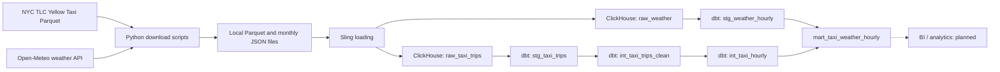

# NYC Taxi & Weather Data Pipeline

## Project overview

An end-to-end analytics pipeline combining NYC Yellow Taxi trip data with hourly New York weather data. Python downloads monthly source files, Sling loads them into ClickHouse, and dbt transforms them into an analytical mart for exploring taxi demand, revenue, trip quality, and weather conditions by hour.

The project currently covers **January 2025 through May 2026**. Taxi data comes from the NYC TLC Yellow Taxi Parquet dataset; weather comes from the Open-Meteo historical weather API for New York City.

## Architecture



Docker Compose runs ClickHouse with persistent storage. `uv` manages the Python environment and dbt dependencies. Transformations execute in ClickHouse; staging and intermediate models are views, and the final mart is a `MergeTree` table.

## Data layers

| Relation | Grain | Purpose |
|---|---|---|
| `raw_taxi_trips` | One source taxi record | Sling-loaded Parquet records with normalized column names and ingestion metadata. |
| `raw_weather` | One monthly JSON payload | Preserves nested Open-Meteo hourly arrays in `data`, plus Sling metadata. |
| `stg_taxi_trips` | One source taxi record | Standardizes column names without filtering or deduplicating rows. |
| `stg_weather_hourly` | One weather hour | Extracts nine measurements and expands aligned arrays with `arrayZip` and a single `ARRAY JOIN`. |
| `int_taxi_trips_clean` | One retained taxi record | Keeps pickups in `[2025-01-01, 2026-06-01)` and adds duration, pickup hour, and quality flags. |
| `int_taxi_hourly` | One pickup hour | Counts all retained records and quality flags; calculates sums and averages for valid trips. |
| `mart_taxi_weather_hourly` | One weather hour | Left joins taxi metrics onto the complete weather timeline and adds calendar fields and valid-trip rate. |

Weather timestamps preserve Open-Meteo local wall-clock values using a UTC-typed datetime, without converting them into UTC instants. This avoids DST normalization when joining to timezone-naive taxi timestamps; `America/New_York` remains timezone metadata.

Hourly distance and duration sums support weighted daily or monthly averages: divide the summed metric by the summed valid-trip count rather than averaging hourly averages.

## Data quality

Suspicious records remain available for analysis. A valid trip has dropoff after pickup, duration at most 240 minutes, distance greater than zero and at most 100 miles, and non-negative fare and total amount. Missing passenger count is informational. Negative fares and totals are flagged as refunds or corrections; negative tips are preserved.

Implemented dbt checks include:

- Required taxi timestamps and location identifiers, plus accepted payment codes.
- Unique, non-null weather hours; required weather measurements; expected timezone.
- Non-null pickup hours and binary quality flags, with uniqueness at hourly grains.
- Hourly count reconciliation and bounds for valid, invalid, and suspicious-record counts.
- Mart rate bounds and arithmetic consistency within `0.000000001`, zero counts and sums for missing taxi hours, null averages and rates for those hours, and calendar-field consistency.

The latest verified end-to-end dbt build completed with **`PASS=45, WARN=0, ERROR=0, SKIP=0`**. This is a recorded build result covering models and tests, not a fixed test-count guarantee. Tests do not hardcode the number of hours or reject missing taxi hours during DST transitions.

## Verified results

Snapshot from the completed build and verification:

| Metric | Result |
|---|---:|
| Modeled taxi records | 67,721,846 |
| Final mart rows | 12,384 |
| Unique hourly timestamps | 12,384 |
| Period | 2025-01-01 00:00 through 2026-05-31 23:00 |
| Hours without taxi records | 2 |
| Valid trips | 62,242,363 |
| Invalid trips | 5,479,483 |
| Mart engine | `MergeTree` |
| Sorting key | `analysis_hour` |
| Monthly partition key | `toYYYYMM(analysis_hour)` |
| Current mart size | 2.01 MiB |

Hours without taxi records retain zero taxi counts and sums, while averages and `valid_trip_rate` remain `NULL`. These hours remain in the weather-based timeline.

## Repository structure

```text
.
├── README.md
├── .env.example
├── .gitignore
├── compose.yaml
├── pyproject.toml
├── uv.lock
├── data/
│   └── references/
│       └── taxi_zone_lookup.csv
├── scripts/
│   ├── download_taxi_data.py
│   └── download_weather_data.py
├── sling/
│   ├── taxi_to_clickhouse.yaml
│   └── weather_to_clickhouse.yaml
└── dbt/
    ├── README.md
    ├── dbt_project.yml
    ├── profiles.yml.example
    ├── models/
    │   ├── staging/
    │   │   ├── sources.yml
    │   │   ├── stg_taxi_trips.sql
    │   │   ├── stg_taxi_trips.yml
    │   │   ├── stg_weather_hourly.sql
    │   │   └── stg_weather_hourly.yml
    │   ├── intermediate/
    │   │   ├── int_taxi_trips_clean.sql
    │   │   ├── int_taxi_trips_clean.yml
    │   │   ├── int_taxi_hourly.sql
    │   │   └── int_taxi_hourly.yml
    │   └── marts/
    │       ├── mart_taxi_weather_hourly.sql
    │       └── mart_taxi_weather_hourly.yml
    └── tests/
        ├── assert_int_taxi_hourly_consistency.sql
        └── assert_mart_taxi_weather_hourly_consistency.sql
```

The tree omits local source data, credentials, virtual environments, and generated artifacts. The taxi zone lookup is available as reference data; the current models do not join it.

## Setup and execution

Prerequisites: Python 3.12 or newer, `uv`, Docker with Compose, and the Sling CLI. Source downloads require internet access and sufficient local storage for the monthly taxi files. Run commands from the repository root.

**1. Configure the local environment.** Create local copies without replacing existing configuration:

```sh
cp -n .env.example .env
cp -n dbt/profiles.yml.example dbt/profiles.yml
uv sync --locked
```

Set `CLICKHOUSE_DB`, `CLICKHOUSE_USER`, and `CLICKHOUSE_PASSWORD` in `.env` to your local values. Keep the environment-variable references in the dbt profile. Both local files are ignored by Git; do not commit credentials.

Compose reads `.env` automatically. Export its values for dbt, which does not load that file automatically:

```sh
set -a
. ./.env
set +a
```

**2. Start ClickHouse.**

```sh
docker compose up -d clickhouse
```

The service uses ClickHouse 26.8, exposing HTTP on `127.0.0.1:8123` and the native protocol on `127.0.0.1:9000`. The dbt profile uses HTTP with two threads.

**3. Download the source files.** The scripts cover the configured 17 months and skip files that already exist.

```sh
uv run python scripts/download_taxi_data.py
uv run python scripts/download_weather_data.py
```

**4. Load a fresh database.** Configure a local Sling ClickHouse connection named `NYC_TAXI_CLICKHOUSE` using the same database and credentials. The replication files reference this connection; its definition is not included in the repository.

For the initial load only, when neither raw table exists:

```sh
sling run -r sling/taxi_to_clickhouse.yaml
sling run -r sling/weather_to_clickhouse.yaml
```

The committed replication files use `full-refresh`, which replaces existing target tables. Skip this step when using an already loaded database. Sling records the source file URL and load timestamp, and preserves nested weather JSON for dbt to expand.

**5. Build and test the mart and its dependencies.**

```sh
uv run dbt build --project-dir dbt --profiles-dir dbt \
  --select +mart_taxi_weather_hourly
```

## Main technologies

| Technology | Role |
|---|---|
| Python | Downloads monthly taxi Parquet files and Open-Meteo weather JSON using the standard library. |
| Sling | Loads local files into ClickHouse raw tables and adds ingestion metadata. |
| ClickHouse | Executes transformations and stores the analytical mart in a monthly partitioned `MergeTree` table. |
| dbt Core + dbt-clickhouse | Defines model dependencies, SQL transformations, documentation, and data-quality tests. |
| Docker Compose | Runs the local ClickHouse service with persistent data and log volumes. |
| uv | Manages Python dependencies through `pyproject.toml` and `uv.lock` and runs project commands. |

DuckDB artifacts are excluded by `.gitignore`, but no DuckDB processing step is defined in the committed scripts or configurations.

## Current status / next step

Ingestion, transformation, data-quality testing, and the final analytical mart are complete. The next planned stage is connecting a BI tool and building the dashboard.
